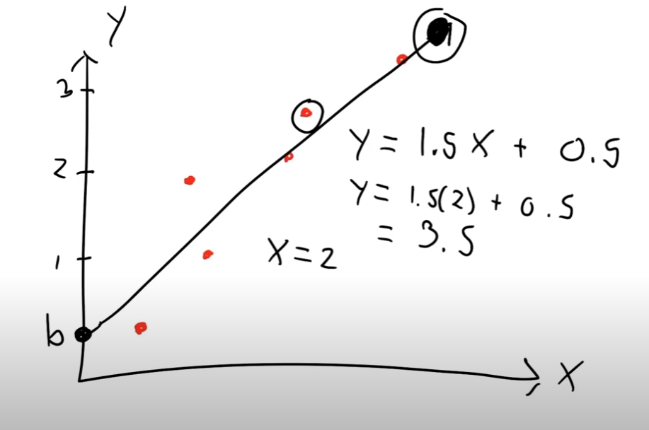
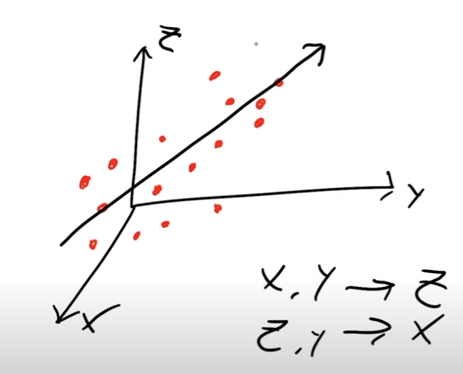

# Machine Learning FreeCodeCamp Notes

# Artificial Intelligence

The efford to automate intellectual tasks
normally performed by humans.

So we can define very specific rules for a program
to run and still be AI, like a game of checkers.

## Machine Learning

A part of AI, that aims to create the rules itself, given an
input and an expected output.

### Neural Network

A form of machine learning that uses layered representation of
data. By default Machine learning only has one layer, the input layer

1. Input information are `Features`
2. Output information are `Labels`

# TensorFlow

To install it we do:

```python
    pip install tensorflow
    pip install tensorflow-gpu
```

To import it:

```python
    %tensorflow_version 2.x  # this line is not required unless you are in a notebook
    import tensorflow as tf  # now import the tensorflow module
    print(tf.version)  # make sure the version is 2.x
```

## Tensor

A tensor is a generalization of vectors and matrices to potentially higher dimensions.
It has:

1. `data type`: float32, int32, string and others.
2. `shape`: Represents the dimension of data.

`Rank/Degree` of Tensors is the number of dimensions involved in the tensor, the max elements that are
deeply nested for example:

```python
    rank2_tensor = tf.Variable([["test", "ok"], ["test", "yes"]], tf.string)
    also_rank2_tensor = tf.Variable(["test", "ok"], tf.string)
    also_also_rank2_tensor = tf.Variable([["test", "ok"], ["test", "ok"], ["test", "yes"]], tf.string)
```

to see the rank we call `tf.rank(rank2_tensor)`.

`shape` as we said is the dimention of data, the number of elements that exist in each dimension,
if we would call `.shape`, we would get `[number_of_arrays, number_of_elements_in_arrays]`, for example:

```python
    also_rank2_tensor.shape
    # outputs TensorShape([1, 2])

    rank2_tensor = tf.Variable(["test", "ok"], tf.string)
    # It's not array in array, so it's TensorShape([2])
```

### TensorFlow Core Learning Algorithms

1. `Linear Regression`
   Linear regression follows a very simple concept. If data points are related linearly, we can generate a line of best fit for these points and use it to predict future values.

   Linear could be discribed as one value goes up, other goes down, like life expectancy with years.

   Splitting the data we want an equal ammount in both sides that are splitted.

   - In 2d
     

   - In 3d
     

   Once we've generated this line for our dataset, we can use its equation to predict future values. We just pass the features of the data point we would like to predict into the equation of the line and use the output as our prediction.
